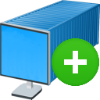
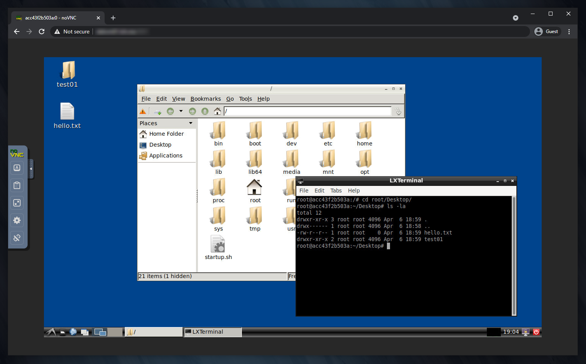

# desktainer-plus



[](https://github.com/dmotte/desktainer-plus/actions)
[](https://hub.docker.com/r/dmotte/desktainer-plus)

:computer: Remote **desk**top in a cont**ainer** (extended version). This is an extension of the [dmotte/desktainer](https://github.com/dmotte/desktainer) Docker image.

> :package: This image is also on **Docker Hub** as [`dmotte/desktainer-plus`](https://hub.docker.com/r/dmotte/desktainer-plus) and runs on **several architectures** (e.g. amd64, arm64, ...). To see the full list of supported platforms, please refer to the `.github/workflows/docker.yml` file. If you need an architecture which is currently unsupported, feel free to open an issue.

## Usage

The simplest way to try this image is:

```bash
docker run -it --rm \
    -p 6901:6901 \
    -p 4200:4200 \
    dmotte/desktainer-plus
```

Then:

- head over to http://localhost:6901/ to access the **remote desktop**;
- head over to http://localhost:4200/ to access the in-browser **remote shell**;



For a more complex usage example, refer to the `docker-compose.yml` file.

> :bulb: **Tip**: If you need to, you can further extend this project by making your own `Dockerfile` starting from this image (i.e. `FROM dmotte/desktainer`) and/or mount custom *supervisor* configuration files.

### Environment variables

Same as the [dmotte/desktainer](https://github.com/dmotte/desktainer) project.

## Development

If you want to contribute to this project, the first thing you have to do is to **clone this repository** on your local machine:

```bash
git clone https://github.com/dmotte/desktainer-plus.git
```

Then you just have to run this command:

```bash
docker-compose up --build
```

This will automatically **build the Docker image** using the `docker-build` directory as build context and then the **Docker-Compose stack** will be started.

If you prefer to run the stack in daemon (detached) mode:

```bash
docker-compose up -d
```

In this case, you can view the logs using the `docker-compose logs` command:

```bash
docker-compose logs -ft
```
