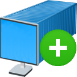

# desktainer-plus



[](https://github.com/dmotte/desktainer-plus/actions)
[](https://hub.docker.com/r/dmotte/desktainer-plus)

:computer: Remote **desk**top in a cont**ainer** (extended version). This is an extension of the [dmotte/desktainer](https://github.com/dmotte/desktainer) Docker image.

> :package: This image is also on **Docker Hub** as [`dmotte/desktainer-plus`](https://hub.docker.com/r/dmotte/desktainer-plus) and runs on **several architectures** (e.g. amd64, arm64, ...). To see the full list of supported platforms, please refer to the [`.github/workflows/release.yml`](.github/workflows/release.yml) file. If you need an architecture which is currently unsupported, feel free to open an issue.

> :calendar: The build process of this Docker image is **triggered automatically every month** (thanks, [GitHub Actions](https://github.com/features/actions)! :smile:) to ensure that you get it with all the latest updated packages. See the [workflow file](.github/workflows/release.yml) for further information.

## Extensions

On top of the base [dmotte/desktainer](https://github.com/dmotte/desktainer) image, we have:

- installed some **additional packages** (`nano`, `curl`, `zip`, `tmux`, etc.)
- installed the **Firefox** web browser
- installed the **OpenSSH server**
  - configured it in _supervisor_ as a service
  - running on **port 22**
- installed **Shell In A Box**
  - configured it in _supervisor_ as a service
  - running on **port 4200**
- already created a custom user named `mainuser` and made some customizations to it

See the [`build/Dockerfile`](build/Dockerfile) file for further details.

## Usage

The first thing you'll need are **host keys** for the OpenSSH server. You can generate them with the following commands:

```bash
mkdir -p hostkeys/etc/ssh
ssh-keygen -Af hostkeys
mv hostkeys/etc/ssh/* hostkeys
rm -r hostkeys/etc
```

If you omit this step, the **OpenSSH server** will actively **refuse all the connections** (which is OK if you don't need it).

Then you can start your container with:

```bash
docker run -it --rm \
    -v $PWD/hostkeys/ssh_host_dsa_key:/etc/ssh/ssh_host_dsa_key:ro \
    -v $PWD/hostkeys/ssh_host_dsa_key.pub:/etc/ssh/ssh_host_dsa_key.pub:ro \
    -v $PWD/hostkeys/ssh_host_ecdsa_key:/etc/ssh/ssh_host_ecdsa_key:ro \
    -v $PWD/hostkeys/ssh_host_ecdsa_key.pub:/etc/ssh/ssh_host_ecdsa_key.pub:ro \
    -v $PWD/hostkeys/ssh_host_ed25519_key:/etc/ssh/ssh_host_ed25519_key:ro \
    -v $PWD/hostkeys/ssh_host_ed25519_key.pub:/etc/ssh/ssh_host_ed25519_key.pub:ro \
    -v $PWD/hostkeys/ssh_host_rsa_key:/etc/ssh/ssh_host_rsa_key:ro \
    -v $PWD/hostkeys/ssh_host_rsa_key.pub:/etc/ssh/ssh_host_rsa_key.pub:ro \
    -p 6901:6901 \
    -p 2222:22 \
    -p 4200:4200 \
    dmotte/desktainer-plus
```

Then:

- head over to http://localhost:6901/ to access the **remote desktop**;
- head over to http://localhost:4200/ to access the in-browser **remote shell**;
- connect to `localhost` on port `2222` via _SSH_ to log into the **OpenSSH server**.


> :bulb: **Tip**: If you want to **change the resolution** while the container is running, you can use the `xrandr --fb 1024x768` command. The new resolution cannot be larger than the one specified in the `RESOLUTION` environment variable though.

For a more complex usage example, refer to the [`docker-compose.yml`](docker-compose.yml) file.

> :bulb: **Tip**: If you need to, you can further extend this project by making your own `Dockerfile` starting from this image (i.e. `FROM dmotte/desktainer-plus`) and/or mount custom _supervisor_ configuration files.

### Run commands at container startup

If you need to run commands at container startup, you can create Bash scripts in the following locations:

- `/opt/startup-early/*.sh`: these scripts will be included in alphabetical order **before** the main container initialization process
- `/opt/startup-late/*.sh`: these scripts will be included in alphabetical order **after** the main container initialization process

See the [`startup.sh`](build/startup.sh) script for more details.

Moreover, if you need to run commands after the LXDE startup, you can create launcher files in the `/etc/xdg/autostart` or the `~/.config/autostart` directory.

### Environment variables

Same as the [dmotte/desktainer](https://github.com/dmotte/desktainer) project.

## Development

If you want to contribute to this project, the first thing you have to do is to **clone this repository** on your local machine:

```bash
git clone https://github.com/dmotte/desktainer-plus.git
```

Then you'll have to create your **host keys** (see the [Usage](#Usage) section of this document) inside the `volumes` directory and run:

```bash
docker-compose down && docker-compose up --build
```

This will automatically **build the Docker image** using the `build` directory as build context and then the **Docker-Compose stack** will be started.

If you prefer to run the stack in daemon (detached) mode:

```bash
docker-compose up -d
```

In this case, you can view the logs using the `docker-compose logs` command:

```bash
docker-compose logs -ft
```
